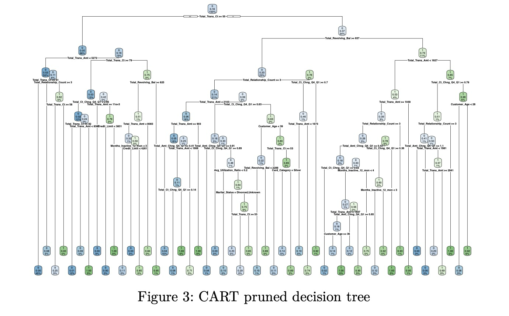

# Data Science Projects

## Predictive Model for Credit Card Attrition

Built a predictive model using CART, Binary Logit, Random Forest, and XGBoost achieving 94.07% accuracy. [Explore the Model](https://github.com/Oluvick/Oluvick.github.io/tree/statistical_modeling).

Feel free to explore the repositories and reach out if you have questions or want to discuss potential collaborations.

